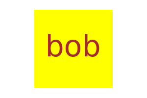

# Logo-Generator

## Description
Creates a logo depending on the user's inputs. It is rendered as a SVG file.

## Table of Contents
- [Installation](#installation)
- [Usage](#usage)
- [License](#license)
- [Contributing](#contributing)
- [Tests](#tests)
- [Questions](#questions)

## Installation
Install Node.js

## Usage
The user is prompted to enter text (up to 3 characters), the color of the text, choose one out of three shapes (circle, triangle, square), and the color of the shape.

## License
 This application is covered under MIT License
You can click on the badge for further information.

## Contributing
n/a

## Tests
Install jest with npm install jest. It will test if the shapes render the correct svg elements.

## Questions
GitHub profile: https://github.com/CYMcolor

