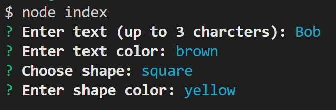
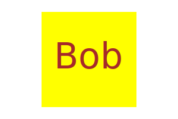

# Logo-Generator

## Description
Creates a logo depending on the user's inputs. It is rendered as a SVG file.

## Table of Contents
- [Installation](#installation)
- [Usage](#usage)
- [License](#license)
- [Contributing](#contributing)
- [Tests](#tests)
- [Contact](#contact)

## Installation
Download code from the GitHub repository. Have Node.js installed. Link to Node.js downloads: https://nodejs.dev/en/download/. In a terminal input npm init -y. Then in the terminal install inquirer version 8.2.4 by inputting npm install inquirer@8.2.4.

Further install validate-color by inputting npm install validate-color

## Usage
When inputting node index in the terminal, the user is prompted to enter text (up to 3 characters), the color of the text, choose one out of three shapes (circle, triangle, square), and the color of the shape. A SVG file will then be created in the eamples folder as logo.svg.

The text prompt will warn the user that the text has more than three charcters or is empty and asked to be entered again. To do this edit the current answer until it satifies the requirements and enter again.

Simiarly both the text color and shape color prompts wil warn the user that the color is invalid and the user will have to edit their answer until it is valid. The code uses the validate-color package to determine if validity and can accept key words, hex code, rgb, rgba, hsl, hsla, hwb, and lch as color formats. If the user tries to use lch, some previews or other apps may not render the color correctly. Both rgb/rgba and hsl/hsla have a transparency setting. Transparency is hard to notice unless the svg is overlaid on a backgroundwith differntiating things. Otherwise it would look like a washed out version of the color chosen.

## License
 This application is covered under MIT License
You can click on the badge for further information.

## Contributing
Node.js (download here: https://nodejs.dev/en/download/)

npm packages: inquirer version 8.2.4 & validate-color

more info on validate-color: https://www.npmjs.com/package/validate-color?activeTab=readme

## Tests
Install jest with npm install jest. It will test if the shapes render the correct svg elements. There should be one test suite (shapes.test.js) with 13 total tests. It tests if the circle, triangle, and square have the correct element being output with the setColor() function. It also tests if the text element matches the text and the text color. And finally it tests if the SVG file renders the expected result.

## Contact
GitHub profile: https://github.com/CYMcolor

